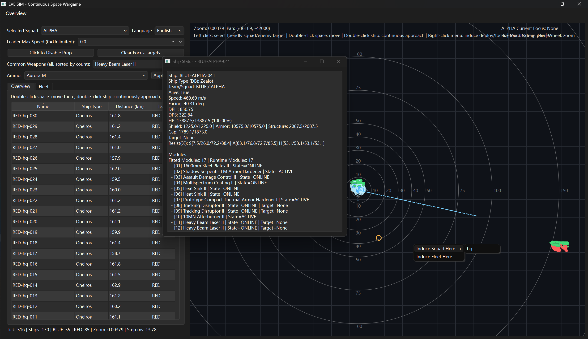

# EVE_PYFSim

by StabberORVexor from CACX FRT

---



## What is this? 这是什么？

EVE_PYFSim is a fleet combat simulator for EVE Online that relies on pyfa for accurate ship fitting calculations.

EVE_PYFSim 是一个依赖 pyfa 进行精确舰船装配计算的 EVE Online 舰队战斗模拟器。

- **Feel the FC experience** of EVE Online fleet combat in a continuous space environment
- **体验 EVE Online 指挥官视角**下的连续空间战斗
- **New FC practice, training and debriefing** tool for skill improvement
- **新 FC 的练习、培训、复盘**工具，快速提升指挥能力
- **Fast and cheap comparison** of the strength and counter between different ship classes and fleet compositions
- **快速廉价的不同建制间实力与克制**的对比，无需实际投入游戏内资源
- **Test fleet tactics** before taking them into real combat
- **在实战前测试舰队战术**，降低试错成本

---

## Features 功能特点

### Core Simulation 核心模拟
- **Continuous space combat** with realistic physics (inertia, turning rates, acceleration)
- **连续空间战斗**，包含真实的物理模拟（惯性、转向率、加速）
- **Accurate ship fitting** based on pyfa database with full module support
- **基于 pyfa 数据库的精确舰船装配**，支持完整模块效果
- **Realistic combat mechanics**: locking, turret tracking, missile damage, EWAR, capacitor management
- **真实的战斗机制**：锁定、炮台跟踪、导弹伤害、电子战、电容管理
- **Multiple ship quality levels** (ELITE/REGULAR/IRREGULAR) affecting reaction time and firing delays
- **多种舰船素养等级**（精英/常规/杂牌）影响反应时间和开火延迟

### Tactical Control 战术控制
- **Squad-based command system** with formation keeping
- **基于小队的指挥系统**，包含阵型保持
- **Focus fire and pre-focus queue** mechanics
- **集火与预集火队列**机制
- **Leader speed limits** for coordinated movement
- **队长速度限制**，实现协同机动
- **Propulsion module toggling** for tactical positioning
- **推进模块开关**，控制战术走位
- **Approach commands** for continuous pursuit
- **接近命令**，实现持续追击

### Fleet Management 舰队管理
- **Fleet library** system for saving and reusing fleet compositions
- **舰队库系统**，保存和复用舰队配置
- **EFT format import** - copy any fit directly from in-game
- **EFT格式导入** - 直接从游戏中复制配装
- **Ammo switching** across entire fleet with proper reload timers
- **全舰队弹药切换**，包含正确的装填时间
- **Ship assignment** between squads
- **舰船跨小队分配**

### Multiplayer 多人模式
- **LAN host/client mode** for two-player FC vs FC battles
- **局域网主机/客户端模式**，支持双人指挥官对战
- **Real-time state synchronization** between blue and red commanders
- **蓝红双方指挥官实时状态同步**
- **Match countdown** system for fair starts
- **比赛倒计时系统**，确保公平开局

### UI Features 界面功能
- **Interactive tactical map** with pan/zoom
- **交互式战术地图**，支持平移/缩放
- **Ship status monitoring** with detailed module states
- **舰船状态监控**，包含详细的模块状态
- **Filterable overview** with sorting
- **可筛选的总览**，支持排序
- **Multi-language support** (中文/English)
- **多语言支持**（中文/English）
- **Ship status dialogs** with real-time updates
- **舰船状态对话框**，实时更新

---

## System Requirements 系统要求

- **OS**: Windows (Linux/MacOS support coming soon)
- **操作系统**: Windows（Linux/MacOS 即将支持）
- **Python**: 3.13
- **Required PyPI packages**: PySide6, numpy
- **External dependency**: [pyfa](https://github.com/pyfa-org/Pyfa) (for ship fitting database)

---

## Installation 安装指南

### 1. Install Python 安装 Python 3.13
Download and install Python 3.13 from [python.org](https://www.python.org/downloads/)

从 [python.org](https://www.python.org/downloads/) 下载并安装 Python 3.13

### 2. Clone repository 克隆仓库
```bash
git clone https://github.com/BHBNSN/EVE_PYFSim.git
cd EVE_PYFSim
```

### 3. Install dependencies 安装依赖
```bash
pip install -r requirements.txt
```

### 4. Set up pyfa 配置 pyfa
This simulator requires pyfa for accurate ship fitting data. Two options:

本模拟器需要 pyfa 提供精确的舰船装配数据。两种方式：

**Option A: Automatic (Recommended) 自动配置（推荐）**
- Place pyfa source code in the parent directory of EVE_PYFSim:
- 将 pyfa 源代码放在 eve_sim 的上级目录：
```
Parent Directory/
├── Pyfa-master/          # pyfa source code
│   ├── eos/
│   ├── service/
│   └── eve.db
└── eve_sim/           # this simulator
```

**Option B: Environment variable 环境变量**
Set `PYFA_SOURCE_DIR` environment variable pointing to your pyfa directory:
设置 `PYFA_SOURCE_DIR` 环境变量指向你的 pyfa 目录：
```bash
set PYFA_SOURCE_DIR=C:\path\to\pyfa
```

---

## Quick Start 快速开始

### Run the simulator 运行模拟器
```bash
python main.py
```

### Basic workflow 基本流程

1. **Select battle mode** 选择战斗模式
   - Local: Solo practice
   - 本地：单人练习
   - Host LAN: Host a match (Blue commander)
   - 主机：主持比赛（蓝方指挥官）
   - Join LAN: Join a match (Red commander)
   - 加入：加入比赛（红方指挥官）

2. **Configure fleets** 配置舰队
   - Select blue and red fleet templates
   - 选择蓝队和红队舰队模板
   - Or edit individual ships
   - 或编辑单舰配置
   - Validate all fits before starting
   - 开始前校验所有配装

3. **Battle!** 开始战斗！
   - Double-click space to move selected squad
   - 双击空地移动选中小队
   - Double-click enemy ship to approach
   - 双击敌舰持续接近
   - Right-click for command menu (focus/pre-focus/induce spawn)
   - 右键打开指令菜单（集火/预集火/诱导部署）
   - Left-click to select squad/enemy
   - 左键选择小队/敌方目标
   - Middle-drag to pan, scroll to zoom
   - 中键拖拽平移，滚轮缩放

4. **Monitor battle** 监控战斗
   - Use overview tab for tactical information
   - 使用总览页签查看战术信息
   - Double-click any ship to view detailed status
   - 双击任意舰船查看详细状态
   - Watch the tactical map for positioning
   - 观察战术地图了解走位

---

## Architecture Overview 架构概述

```
┌─────────────────────────────────────────────────────────────┐
│                        GUI (gui_app.py)                      │
│                    PySide6-based interface                   │
└───────────────────────────┬─────────────────────────────────┘
                            │ Commands/Updates
                            ▼
┌─────────────────────────────────────────────────────────────┐
│                 Simulation Engine (simulation_engine.py)    │
│                         Main simulation loop                 │
└───────────┬─────────────────────┬─────────────────────┬─────┘
            │                      │                     │
            ▼                      ▼                     ▼
┌─────────────────────┐ ┌─────────────────────┐ ┌─────────────────────┐
│  Agents (agents.py) │ │  Systems (systems.py)│ │   World (world.py)  │
│  - CommanderAgent   │ │  - CombatSystem      │ │  - ShipEntity       │
│  - ShipAgent        │ │  - MovementSystem    │ │  - WorldState       │
│                     │ │  - PerceptionSystem  │ │                     │
└─────────────────────┘ └─────────────────────┘ └─────────────────────┘
                              │
                              ▼
                    ┌─────────────────────┐
                    │  Pyfa Integration   │
                    │  (fleet_setup.py,   │
                    │   fit_runtime.py)   │
                    └─────────────────────┘
```

---

## Command Reference 命令参考

### Mouse Controls 鼠标操作
| Action 操作 | Effect 效果 |
|-------------|------------|
| Left click 左键 | Select friendly squad / enemy target 选择己方小队/敌方目标 |
| Double-click space 双击空地 | Move selected squad 移动选中小队 |
| Double-click ship 双击舰船 | Continuously approach 持续接近 |
| Right click 右键 | Open command menu 打开指令菜单 |
| Middle drag 中键拖拽 | Pan view 平移视图 |
| Scroll 滚轮 | Zoom in/out 缩放 |

### Keyboard/UI Commands 键盘/界面命令
| Command 命令 | Function 功能 |
|--------------|---------------|
| Squad dropdown 小队下拉菜单 | Select active squad 选择当前小队 |
| Leader speed limit 队长速度限制 | Set max speed for squad leader 设置队长最大速度 |
| Propulsion toggle 推进开关 | Enable/disable propulsion modules 开启/关闭推进模块 |
| Clear focus 清除集火 | Remove all focus targets 清除所有集火目标 |
| Weapon/Ammo selection 武器/弹药选择 | Switch ammo across fleet 切换全舰队弹药 |
| Assign ships 分配舰船 | Move selected ships to squad 将选中舰船分配到小队 |


## Development Status 开发状态

### Implemented 已实现
- ✅ Continuous space physics simulation
- ✅ 连续空间物理模拟
- ✅ Pyfa-based fitting with module effects
- ✅ 基于 pyfa 的配装和模块效果
- ✅ Turret and missile combat mechanics
- ✅ 炮台与导弹战斗机制
- ✅ EWAR (webs, damps, TDs, ECM, painters, neuts)
- ✅ 电子战（网、抑阻、TD、ECM、标记、中和）
- ✅ Remote repair and logistics
- ✅ 远程维修与后勤
- ✅ Squad-based command system
- ✅ 基于小队的指挥系统
- ✅ LAN multiplayer
- ✅ 局域网多人模式
- ✅ Fleet library and template management
- ✅ 舰队库与模板管理
- ✅ Ammo switching with reload timers
- ✅ 弹药切换与装填时间

### In Progress 进行中
- 🔄 More comprehensive and smart EWAR effects
- 🔄 更全面智能的电子战效果

### Planned 计划中
- 📅 Missile system mechanics
- 📅 导弹系统适配
- 📅 Customize the map configuration
- 📅 自定义地图配置
- 📅 Bomb mechanics
- 📅 炸弹机制
- 📅 Warp mechanics
- 📅 跃迁机制

---

## Contributing 贡献

Contributions are welcome! Feel free to submit issues and pull requests.

欢迎贡献！随时提交问题或拉取请求。

---

## License 许可证
GPL-3.0 License. See LICENSE file for details.
This project is for educational and simulation purposes only. All EVE Online assets and intellectual property belong to CCP hf.

GPL-3.0 许可证。详情请参阅 LICENSE 文件。
本项目仅用于教育和模拟目的。所有 EVE Online 资产和知识产权归 CCP hf 所有。

---

## Credits 致谢

- **pyfa team** for their excellent fitting tool and database
- **pyfa 团队**提供的优秀配装工具和数据库
- **CCP Games** for creating EVE Online
- **CCP Games** 创造了 EVE Online
- All testers and contributors from CACX
- CACX 的所有测试者和贡献者

---

## Contacts 联系方式

**StabberORVexor / N0rth5ea**
- EVE Online: StabberORVexor
- Email: 2773718257@qq.com
- QQ: 2773718257
- GitHub: [BHBNSN](https://github.com/BHBNSN)
- Discord: BHBNSN

---

## CCP Copyright Notice

EVE Online, the EVE logo, EVE and all associated logos and designs are the intellectual property of CCP hf. All artwork, screenshots, characters, vehicles, storylines, world facts or other recognizable features of the intellectual property relating to these trademarks are likewise the intellectual property of CCP hf. EVE Online and the EVE logo are the registered trademarks of CCP hf. All rights are reserved worldwide. All other trademarks are the property of their respective owners. CCP is in no way responsible for the content on or functioning of this program, nor can it be liable for any damage arising from the use of this program.