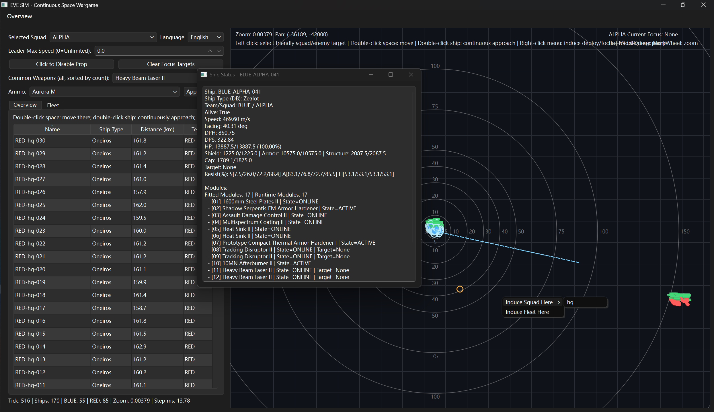

# EVE_PYFSim

[简体中文](README.zh-CN.md)

**EVE_PYFSim** is a fan-made fleet combat simulator for **EVE Online**, built around **pyfa/eos-backed fitting data** and a continuous 2D tactical battlefield. It is designed for FC practice, fleet composition testing, tactical debriefing, and fast what-if analysis before committing real in-game assets.

> EVE_PYFSim is not an official CCP product, not a private server, and not an EVE client automation tool. It is an offline simulator for education, tactics, and experimentation.

---

## Preview



---

## Why this project exists

Large fleet decisions in EVE are expensive to test directly. EVE_PYFSim provides a low-cost sandbox for answering questions such as:

- Can this doctrine catch, hold, and kill the opposing composition?
- How much does positioning, focus fire, or pre-focus sequencing change the result?
- Which fleet wins under different starting ranges, map layouts, or command decisions?
- How do EWAR, remote repair, drones, fighters, bombs, bubbles, and warp behavior affect the fight?

The simulator focuses on the **FC-level decision loop**: fleet setup, squad command, target calling, movement, ammunition choices, and post-fight review.

---

## Feature overview

### Core simulation

- Continuous 2D space combat with movement, inertia, acceleration, approach/orbit behavior, formation following, and range control.
- Deterministic tick-based simulation loop suitable for repeatable practice and debugging.
- Ship fitting data resolved through pyfa/eos where available.
- Target locking, lock timers, max targeting range, sensor attributes, ECM restrictions, capacitor usage, and module cycle handling.
- Turret, missile, projectile, bomb, smartbomb, remote repair, command burst, and EWAR simulation.
- Shield, armor, and structure damage layers with resistance-based damage application.
- Warp, gate travel, gate cloak, warp disruption, interdiction bubbles, and bubble interaction logic.

### Fleet and doctrine tools

- EFT-style fit import from in-game or pyfa exports.
- Fleet library for saving and reusing fleet compositions.
- Squad-based command model for FC-style control.
- Focus fire and pre-focus target queues.
- Fleet-wide ammunition switching with reload behavior.
- Ship assignment between squads.
- Quality presets for different pilot discipline levels.

### Drones, fighters, and deployables

- Drone bay parsing, bandwidth limits, active drone limits, launch/recall/attack control, and basic drone EWAR support.
- Fighter bay parsing, fighter tube and slot limits, fighter squadron launch/recall, target assignment, and manual fighter ability activation.
- Bombs, missiles, generic projectiles, smartbomb interception, and bubble/projectile damage interactions.

### UI, LAN, and review

- PySide6 tactical UI with pan/zoom battlefield view.
- Sortable and filterable overview tables.
- Ship status dialogs with module, timer, lock, capacitor, HP, drone, and fighter details.
- Local solo mode for practice and debugging.
- LAN host/client mode for two-player FC-vs-FC battles.
- Replay and battle report infrastructure for post-fight review.
- Simplified Chinese UI translation support.

---

## Simulation fidelity

The project aims to be **mechanically close enough for tactical practice**, while staying explicit about what is still approximated.

| Area | Current approach |
| --- | --- |
| Fitting | pyfa/eos-backed fitting data plus simulator-side runtime projections. |
| Tick model | Local deterministic tick loop, not a real Tranquility server implementation. |
| Space | Continuous 2D battlefield with simplified grid/system abstractions. |
| Turrets and missiles | Formula-based simulation with projectile flight and damage application, but not a complete server clone. |
| Drones and fighters | Functional tactical model with launch, recall, targeting, abilities, and limits; some original-game edge cases are still under development. |
| Warp and bubbles | Practical simulation of warp commands, gate travel, disruption, and bubbles; exact EVE server edge cases are not guaranteed. |
| Dogma | Uses pyfa data where possible, but does not yet implement the complete EVE Dogma system. |

Known missing or incomplete areas include full Dogma modifier coverage, implants, boosters, heat damage, Crimewatch, CONCORD behavior, markets, industry, sovereignty, Upwell structure timers, exact drone/fighter edge cases, and complete PvE NPC behavior.

---

## Requirements

- Windows is the primary tested platform.
- Python 3.13.
- PySide6 and numpy.
- A local pyfa source/data directory. The current simulator data manifest targets **pyfa v2.66.4**.

Linux and macOS may work for the non-platform-specific parts, but they are not the primary release target yet.

---

## Installation

### 1. Clone the repository

```bash
git clone https://github.com/BHBNSN/EVE_PYFSim.git
cd EVE_PYFSim
```

### 2. Create a virtual environment

```bash
python -m venv .venv
.venv\Scripts\activate
```

### 3. Install Python dependencies

```bash
pip install -r requirements.txt
```

### 4. Prepare pyfa

EVE_PYFSim needs pyfa/eos data to resolve ships, modules, charges, drones, fighters, and fitting attributes.

Recommended layout:

```text
EVE_PYFSim/
├── main.py
├── eve_sim/
├── Pyfa-master/
│   ├── eos/
│   ├── service/
│   └── eve.db
└── requirements.txt
```

Alternatively, set `PYFA_SOURCE_DIR` to your pyfa directory:

```bat
set PYFA_SOURCE_DIR=C:\path\to\Pyfa-master
```

PowerShell:

```powershell
$env:PYFA_SOURCE_DIR = "C:\path\to\Pyfa-master"
```

---

## Quick start

Run the launcher:

```bash
python main.py
```

Then choose one of the battle modes:

| Mode | Description |
| --- | --- |
| Local | Solo practice and local simulation. |
| Host LAN | Host a LAN match as the blue-side commander. |
| Join LAN | Join a LAN match as the red-side commander. |

Basic workflow:

1. Select a battle mode.
2. Configure blue and red fleet setups.
3. Import or edit EFT-style ship fits.
4. Validate the fleets.
5. Start the battle and command squads from the tactical map.
6. Review ship states, overview data, replay, and battle reports.

---

## Controls

### Mouse controls

| Action | Effect |
| --- | --- |
| Left click | Select friendly squad or enemy target. |
| Double-click empty space | Move the selected squad. |
| Double-click enemy ship | Approach or pursue the target. |
| Right click | Open the context command menu. |
| Right-click ship | Show ship-specific commands such as focus, pre-focus, or warp. |
| Right-click beacon/gate/system object | Show available travel or warp commands. |
| Middle drag | Pan the tactical map. |
| Mouse wheel | Zoom in or out. |

### UI commands

| Command | Function |
| --- | --- |
| Squad selector | Change the active squad. |
| Leader speed limit | Limit squad leader speed for coordinated movement. |
| Propulsion toggle | Enable or disable propulsion modules for tactical positioning. |
| Clear focus | Remove current focus-fire orders. |
| Weapon/ammo selection | Switch ammunition for eligible ships. |
| Assign ships | Move selected ships between squads. |
| Warp command | Warp the selected squad to a valid ship, beacon, gate, or map object. |
| Fighter ability buttons | Manually activate available fighter squadron abilities. |

---

## Repository layout

```text
eve_sim/
├── agents.py                 # Commander and ship-level decision agents
├── config.py                 # Engine and UI configuration
├── fit_runtime.py            # Runtime module and fit state
├── fleet_setup/              # EFT parsing, pyfa integration, fleet construction
├── gui/                      # PySide6 UI, tactical canvas, dialogs, tables
├── maps/                     # Map/system definitions and loading
├── replay/                   # Replay recording, delta snapshots, playback support
├── scenario/                 # Scenario models, loader, validators
├── systems/                  # Combat, movement, locking, EWAR, logistics, deployables
├── battle_report/            # Battle report models and service
├── simulation_engine.py      # Main simulation loop
└── world.py                  # WorldState and entity containers
```

---

## Development notes

Before submitting a pull request, at minimum run:

```bash
python -m compileall eve_sim
```

When reporting bugs, please include:

- OS and Python version.
- EVE_PYFSim commit or release version.
- pyfa version and whether `PYFA_SOURCE_DIR` is used.
- The fit text or fleet setup that reproduces the issue.
- Steps to reproduce.
- Screenshots, logs, or replay/battle report files when available.

---

## Roadmap

Short-term priorities:

- Add more replay and battle report analysis tools.

Long-term goals:

- Broader Dogma modifier coverage.
- Better performance for large fleet fights.
- More scenario authoring tools.
- Smarter tactical AI for training and doctrine stress testing.

---

## Contributing

Issues, pull requests, test cases, doctrine examples, and mechanic corrections are welcome.

Good contributions usually fall into one of these categories:

- Reproducible bug reports.
- Verified EVE Online mechanic corrections.
- pyfa/SDE compatibility fixes.
- UI and usability improvements.
- Performance profiling and optimization.
- Replay, battle report, or scenario tooling.

---

## License

This project is licensed under the **GPL-3.0 License**. See the `LICENSE` file for details.

---

## Credits

- pyfa team, for the fitting tool, eos logic, and fitting data ecosystem.
- CCP Games, for creating EVE Online.
- CACX testers and contributors.

---

## Contact

**StabberORVexor / N0rth5ea**

- EVE Online: `StabberORVexor`
- GitHub: [BHBNSN](https://github.com/BHBNSN)
- Discord: `BHBNSN`

GitHub Issues are preferred for bug reports and feature requests.

---

## CCP copyright notice

EVE Online, the EVE logo, EVE and all associated logos and designs are the intellectual property of CCP hf. All artwork, screenshots, characters, vehicles, storylines, world facts, or other recognizable features of the intellectual property relating to these trademarks are likewise the intellectual property of CCP hf. EVE Online and the EVE logo are registered trademarks of CCP hf. All rights are reserved worldwide. All other trademarks are the property of their respective owners.

CCP is in no way responsible for the content or functioning of this program, nor can CCP be liable for any damage arising from the use of this program.
